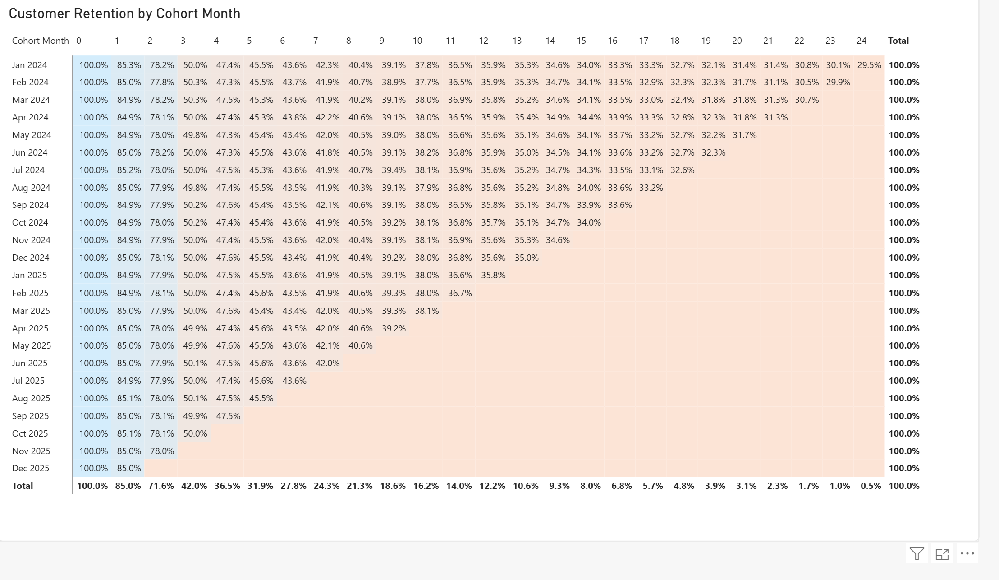
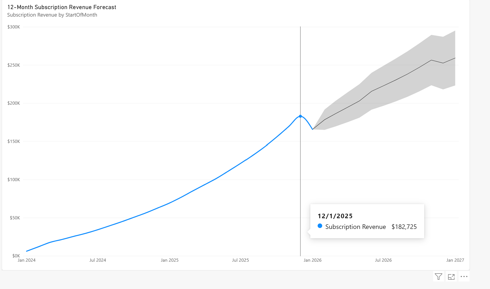
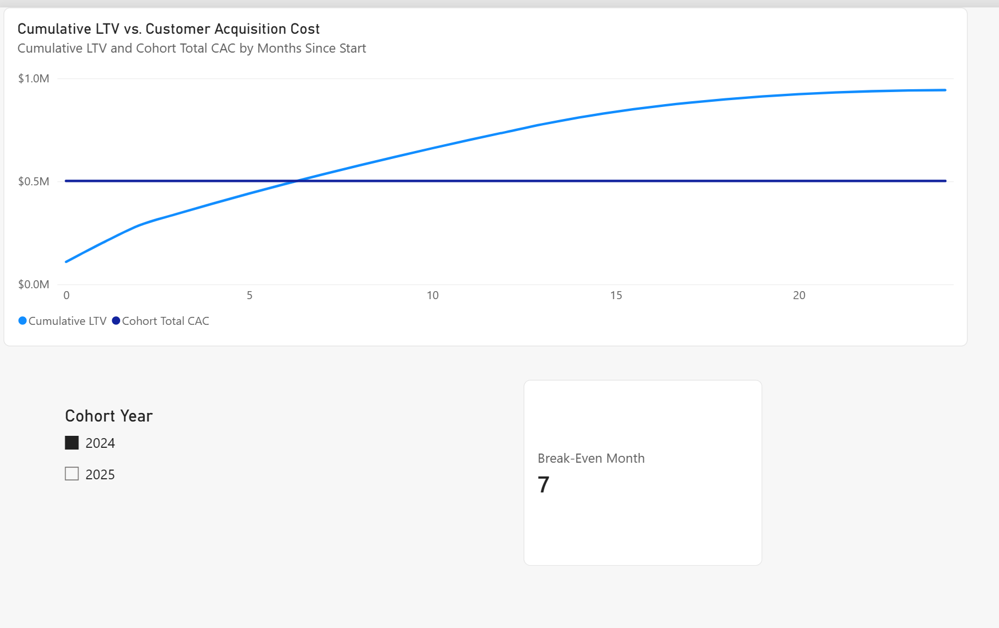
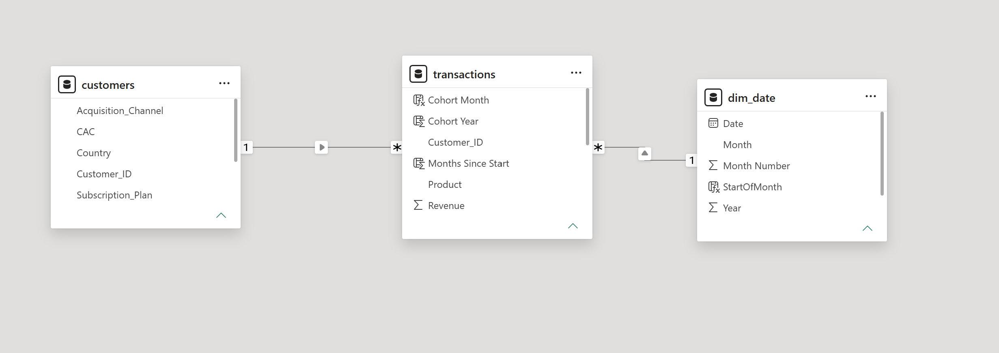

# Fitness Subscription Analytics

## Project Overview

This project analyzes customer subscription behavior, revenue trends, and customer acquisition costs for a fitness subscription business using Power BI. The analysis focuses on customer retention, future subscription revenue, and the relationship between Customer Acquisition Cost (CAC) and Customer Lifetime Value (LTV).

The report includes three main analyses:

- Customer Cohort Analysis
- 12-Month Revenue Forecast
- CAC vs. LTV Analysis

## Customer Cohort Analysis

The cohort analysis shows that customer retention declines most significantly during the first several months after acquisition. Retention falls from 100% in the initial month to approximately 42% by month 3 and continues to decline over time.

This suggests that customer cancellations are concentrated heavily within the first few months of the subscription lifecycle. Improving engagement and retention during this early period could therefore have a significant impact on long-term customer value.

## Revenue Forecast

Historical subscription revenue shows strong growth throughout the observed period. The 12-month Power BI forecast projects that monthly subscription revenue could reach approximately $250,000–$260,000 by the end of the forecast period.

The forecast continues the overall upward revenue trend. Although the historical data contains some fluctuations, the analysis does not provide strong evidence of a consistent seasonal pattern. The forecast should therefore be interpreted primarily as an estimate based on the historical growth trend.

## CAC vs. LTV Analysis

The CAC vs. LTV analysis compares cumulative customer lifetime value with the cost of acquiring customers.

For the **2024 cohort**, cumulative LTV exceeds total CAC at approximately **month 7**. This indicates that it takes about seven months for the 2024 cohort to recover its customer acquisition cost.

For the **2025 cohort**, the break-even point has **not yet been reached within the available observation period**. Because the 2025 cohort has less historical data available, additional months of customer activity are needed before its full CAC recovery period can be determined.

## Key Business Insights

- Customer churn is highest during the early months of the subscription lifecycle.
- Retention efforts should focus particularly on customers during their first several months.
- Subscription revenue is expected to continue growing during the next 12 months.
- There is not strong evidence of consistent seasonality in the available revenue history.
- The 2024 customer cohort recovers its acquisition cost after approximately seven months.
- The 2025 cohort has not yet accumulated enough LTV to demonstrate a break-even point within the available data.

## Tools Used

- Power BI Desktop
- DAX
- Microsoft Excel
- GitHub

## Dashboard Screenshots

### Customer Cohort Analysis

### Revenue Forecast

### CAC vs. LTV

### Data Model

